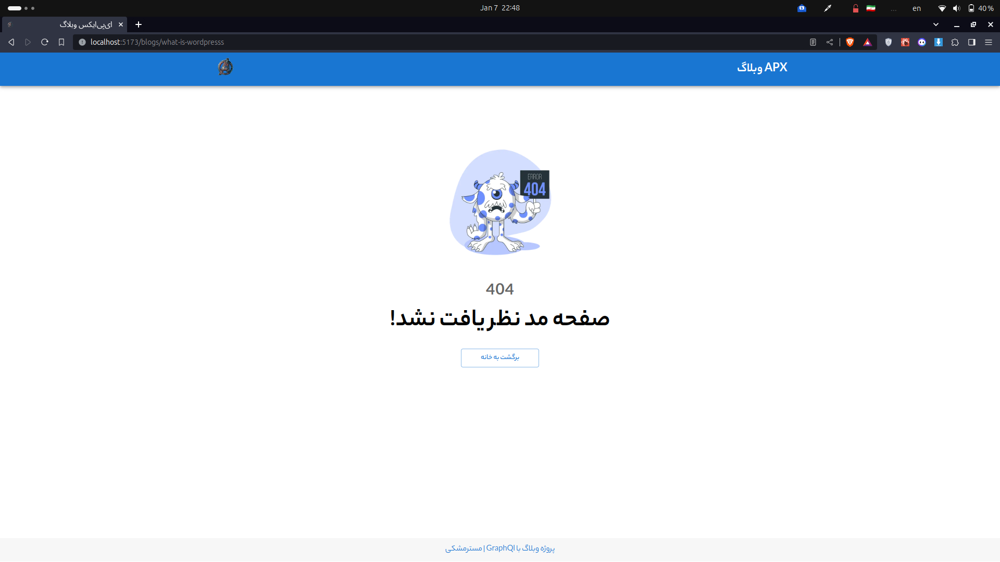

# GraphQl Blog

GraphQl - Material UI - Single page application - Reader folder structure

### The home page of the blog shows the authors and all the posts

### Show author's biography with all written articles

### Show loading for all pages to have a better experience with the site

### Post content display with cover and author information and has a unique slug

### The ability to comment and reply the author on the comments from the management panel, the comment sent must be checked and approved by the website administrator to be displayed

### Displaying site posts at /blogs address

### And finally, if you go to the wrong address, a 404 error will be displayed

- Please invoice the spelling mistake of 'reply' in the project

Developed by [MrMeshky](https://github.com/MR-MESHKY) with ❤

# React + Vite

This template provides a minimal setup to get React working in Vite with HMR and some ESLint rules.

Currently, two official plugins are available:

- [@vitejs/plugin-react](https://github.com/vitejs/vite-plugin-react/blob/main/packages/plugin-react/README.md) uses [Babel](https://babeljs.io/) for Fast Refresh
- [@vitejs/plugin-react-swc](https://github.com/vitejs/vite-plugin-react-swc) uses [SWC](https://swc.rs/) for Fast Refresh
