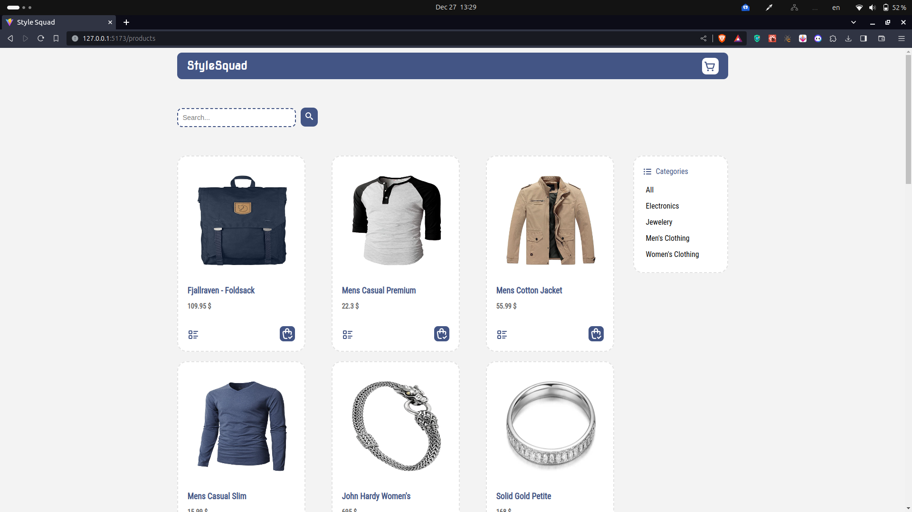
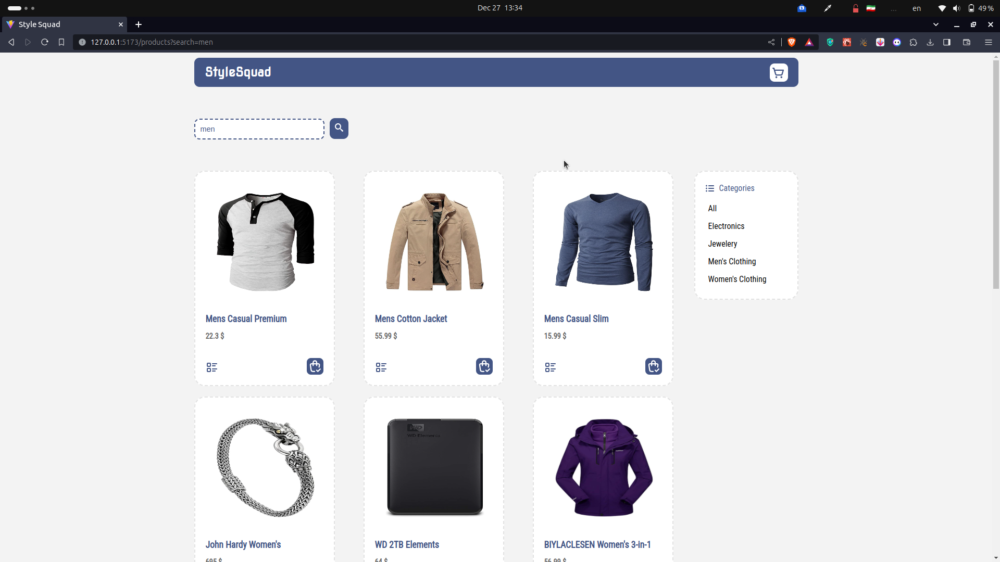
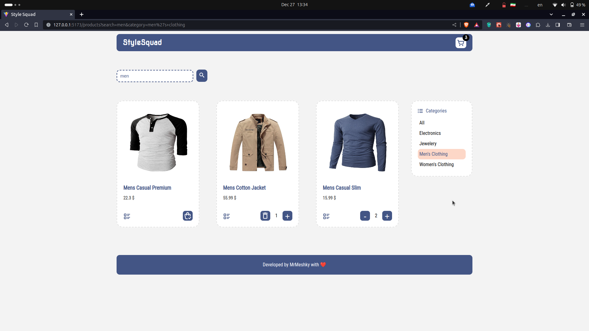
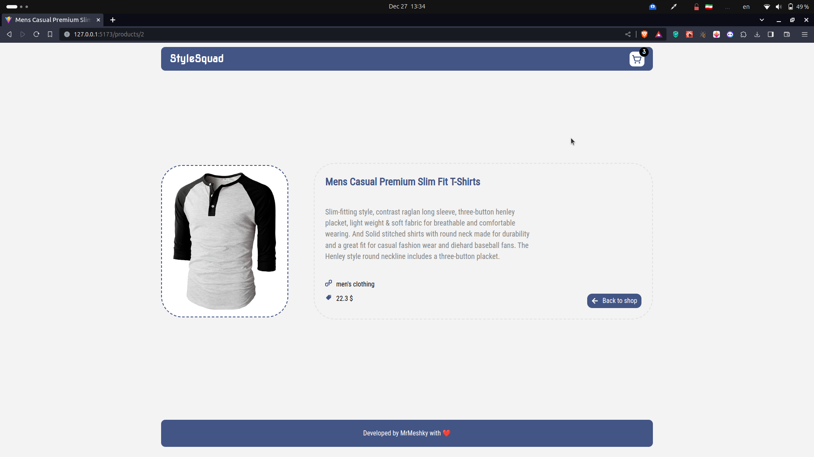
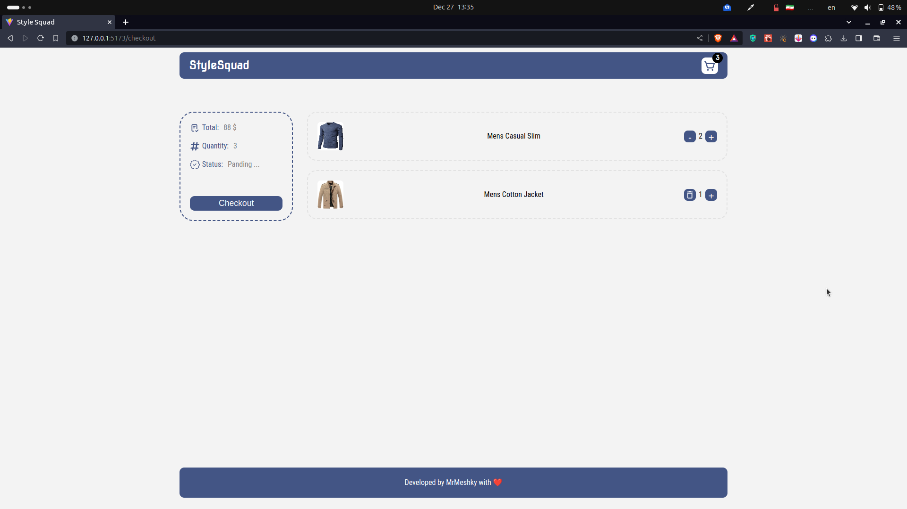
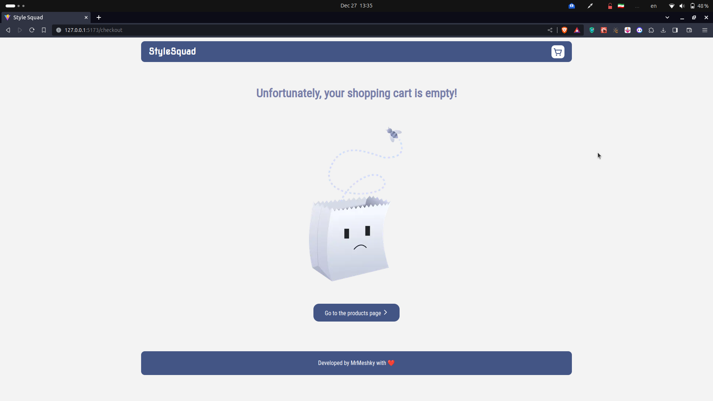

# Store project React.js

Single page application - Context - Reducer (store project)

### Show products from api

### Ability to search products using query

### Searching and filtering products at the same time

### Add products to cart

### The product detail page has a unique url for each product

### Cart

### If the shopping cart is empty

# React + Vite

This template provides a minimal setup to get React working in Vite with HMR and some ESLint rules.

Currently, two official plugins are available:

- [@vitejs/plugin-react](https://github.com/vitejs/vite-plugin-react/blob/main/packages/plugin-react/README.md) uses [Babel](https://babeljs.io/) for Fast Refresh
- [@vitejs/plugin-react-swc](https://github.com/vitejs/vite-plugin-react-swc) uses [SWC](https://swc.rs/) for Fast Refresh
